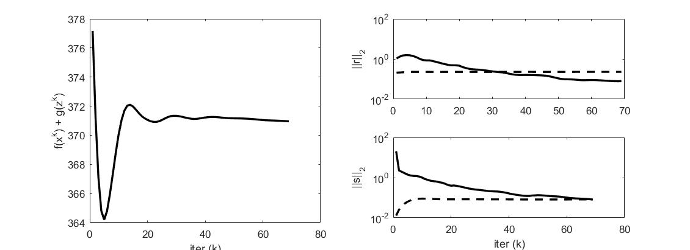
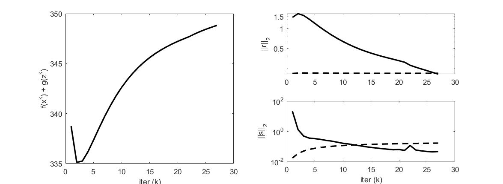

5. Constrained Convex Optimization
=====================================

Consider the constrained convex optimization problems:

.. math::
  \begin{align*}
  & minimize \quad f(x) \\
  & subject \ to \quad x \in C
  \end{align*}

with variable :math:`x \in \mathbb{R}^{n}`, f and C are convex. This problem could be rewrite into :

.. math::
  \begin{align*}
  & minimize \quad f(x) + g(z) \\
  & subject \ to \quad x - z = 0
  \end{align*}

Where g is the indicator function of set C.

The augmented lagrangian (using the scaled dual variable) is :

.. math::
  \mathbb{L}_{\rho}(x,z,u) = f(x) + g(z) + (\rho/2)\|x-z+u \|_{2}^{2}

The scaled form ADMM updates are :

.. math::
  \begin{align*}
  &x^{k+1} := \arg\min_{c} (f(x) + (\rho/2)\|x-z^{k}+u^{k} \|_{2}^{2} ) \\
  &z^{k+1} := \Pi_{C}(x^{k+1} + u^{k}) \\
  &u^{k+1} := u^{k} + x^{k+1} - z^{k+1}
  \end{align*}

With the primal residual and dual residual:

.. math::
  r^{k} = x^{k} - z^{k}, \quad s^{k} = - \rho(z^{k} - z^{k-1}).

5.1 Quadratic Programming
---------------------------------

Consider QP problem:

.. math::
  \begin{align*}
  &minimize \quad  (1/2)x^{T}Px + q^{T}x \\
  &subject\ to \quad Ax = b, \ x \ge 0
  \end{align*}

We form the functions f and g :

.. math::
  f(x) = (1/2)x^{T}Px + q^{T}x, \quad \mathbf{dom}f = \{ x\mid Ax = b \}

.. math::
  g(z) = I_{C}(z), \quad C = \{ x \| x \ge 0 \}

Then the ADMM form of the problem is :

.. math::
  \begin{align*}
  &minimize \quad  f(x) + g(z) \\
  &subject\ to \quad x - z = 0
  \end{align*}

The ADMM update will be :

.. math::
  \begin{align*}
  &x^{k+1} := \arg\min_{x\in \mathbf{dom}f}(f(x) + (\rho/2)\|x - z^{k} + u^{k} \|_{2}^{2})\\
  &z^{k+1} := \Pi_{C}(x^{k+1} + u^{k}) = (x^{k+1} + u^{k})_{+} \\
  &u^{k+1} := u^{k} + x^{k+1} - z^{k+1}
  \end{align*}

The update of X could be reform into a linear equation with an addition dual variable, using the first order optimal condition:

.. math::
  \begin{bmatrix} P + \rho I  & A^{T}\\ A & 0 \end{bmatrix}
  \begin{bmatrix} x^{+} \\ \lambda \end{bmatrix} + \begin{bmatrix}q-\rho (z^{k}-u^{k}) \\ -b \end{bmatrix} = 0

5.2 Test LP
------------------
Here we test the following LP problem:

.. math::
  \begin{align*}
  &minimize \quad c^{T}x \\
  &subject\ to \quad Ax = b , \ x \ge 0
  \end{align*}

Using :math:`x \in \mathbb{R}^{500}` and with :math:`A \in \mathbb{R}^{400\times 500}`, with 500 variables,
and 400 equality constraints.

`Code <http://stanford.edu/~boyd/papers/admm/linprog/linprog.html>`_ and `Example <http://stanford.edu/~boyd/papers/admm/linprog/linprog_example.html>`_ .

We have the result of ADMM:

And the comparsion:

       +-------+---------+----------+
       | method |  optimal value |  cpu time(s) |
       +=======+=========+==========+
       | CVX  |   371.09  |  1.73   |
       +-------+---------+----------+
       | ADMM  |    370.96  |   2.01  |
       +-------+---------+----------+

5.3 Test QP
------------------

.. math::
  \begin{align*}
  &minimize \quad  (1/2)x^{T}Px + q^{T}x \\
  &subject\ to \quad Ax = b, \ x \ge 0
  \end{align*}

Using :math:`x \in \mathbb{R}^{500}` and with :math:`A \in \mathbb{R}^{400\times 500}`, with 500 variables,
and 400 equality constraints.

`Code <https://github.com/gggliuye/cvx_learning/blob/master/matlab/ADMM/quadprog.m>`_ and `Example <https://github.com/gggliuye/cvx_learning/blob/master/matlab/ADMM/quadprog_example.m>`_ .

With x update of matlab ::

  % x-update
  if k > 1
      tmp_b = [ rho*(z - u) - q; b ];
      tmp = U \ (L \ tmp_b);
      x = tmp(1:n);
  else
      tmp_A = [ P + rho*eye(n), A'; A, zeros(m) ];
      [L, U] = lu(tmp_A);
      tmp_b = [ rho*(z - u) - q; b ];
      tmp = U \ (L \ tmp_b);
      x = tmp(1:n);
  end

We have the result of ADMM:

And the comparsion:

       +--------+----------------+--------------+
       | method |  optimal value |  cpu time(s) |
       +========+================+==============+
       | CVX    |        351.98  |    21.5182   |
       +--------+----------------+--------------+
       | ADMM   |        348.82  |       0.166  |
       +--------+----------------+--------------+
