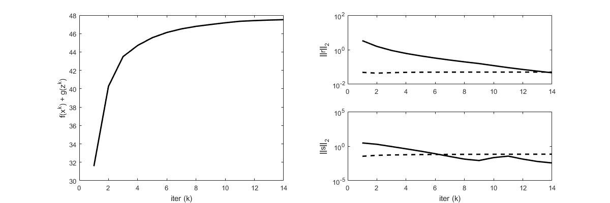

6. L1 Norm Problems
====================

6.1 Huber Fitting
-----------------------------

The huber fitting problem is to fit the data with huber loss (which is a loss more robust to outliers compared to l2 norm).
But as it get quadratic when getting closer to zero, it won't ouput a sparse result.

.. math::
  minimize \quad g^{hub}(Ax- b)

Equivalent to the following problem:

.. math::
  \begin{align*}
  &minimize \quad g^{hub}(z) \\
  & subject\ to \quad Ax -b = z
  \end{align*}

The corresponding ADMM updates are :

.. math::
  \begin{align*}
  &x^{k+1} = \arg\min_{x}( (1/\rho)\|Ax-b-z^{k} + u^{k}\|_{2}^{2}) = (A^{T}A)^{-1}A^{T}(b+z^{k}-u^{k}) \\
  &z^{k+1} = \arg\min_{z} (g^{hub}(z) + (1/\rho)\|Ax^{k+1}-b-z + u^{k}\|_{2}^{2}) = \mathbf{prox}_{1/\rho,g^{hub}}(Ax^{k+1}-b + u^{k}) \\
  &u^{k+1} = u^{k} + Ax^{k+1}-b-z^{k+1}
  \end{align*}

Where the update of x is solving a least square problem. We will solve it using factorization::

  [L U] = factor(A);
  q = Atb + A'*(z - u);
  x = U \ (L \ q);

the update of z is a little more complicate. But we can solve it
exactly by considering the case :math:`\|z\|<1` and :math:`\|z\|>1`, lead to the result:

.. math::
  z^{k+1} = \frac{\rho}{1+\rho}(Ax^{k+1}-b + u^{k}) + \frac{1}{1+\rho}S_{1+1/\rho}(Ax^{k+1}-b + u^{k})

With matlab code::

  tmp = A*x - b + u;
  z = rho/(1 + rho)*tmp + 1/(1 + rho)*shrinkage(tmp, 1 + 1/rho);

**Result**:

`Code <http://stanford.edu/~boyd/papers/admm/huber/huber_fit.html>`_ and
`Test Script <http://stanford.edu/~boyd/papers/admm/huber/huber_fit_example.html>`_ .

6.2 Basis pursuit problem
--------------------------------

The problem is a l1 minizmization in a linear constrained set :

.. math::
  \begin{align*}
  &minimize \quad \|x\|_{1} \\
  &subject\ to \quad Ax = b
  \end{align*}

With m < n, the problem is to find a sparse solution (sparsity corresponding to l1 norm), with
underdetermined system of linear equations.

Reform the problem with two functions : :math:`f(x) = \|x\|_{1}` and :math:`g(z) = I_{C}(z)`.
g is the indicate function of the set C, where :math:`C = \{ z \| Az = b \}`. And adding the consensus constraint :math:`x= z`,
we will have the following equivalent problem:

.. math::
  \begin{align*}
  &minimize \quad \|z\|_{1} + I_{C}(x) \\
  &subject\ to \quad x = z
  \end{align*}

Using the scaled ADMM udpates we have:

.. math::
  \begin{align*}
  &x^{k+1} = \arg\min_{x} (I_{C}(x) + (\rho/2)\|x-z^{k}+u^{k}\|^{2}_{2} ) = \mathbf{prox}_{1/\rho, I_{C}}(z^{k}-u^{k}) \\
  &z^{k+1} = \arg\min_{z} (\|z\|_{1} + (\rho/2)\|x^{k+1}-z+u^{k}\|^{2}_{2} ) = \mathbf{prox}_{1/\rho, l1}(x^{k} + u^{k})\\
  &u^{k+1} = u^{k} + x^{k+1} -z^{k+1}
  \end{align*}

From the evaluation of proximal operators, we know the proximal operator of indicator function is equivalent to the projection operator.
And the proximal oprator of the l1 norm is a shrinkage funtion. As a result, we have the following updates:

.. math::
  \begin{align*}
  &x^{k+1} = \Pi_{c}(z^{k}-u^{k}) \\
  &z^{k+1} = S_{1/\rho}(x^{k} + u^{k})\\
  &u^{k+1} = u^{k} + x^{k+1} -z^{k+1}
  \end{align*}

6.2.2 Updates
~~~~~~~~~~~~~~~~~~~

The shrinkage function is::

  function y = shrinkage(a, kappa)
      y = max(0, a-kappa) - max(0, -a-kappa);
  end

The projection into C is :

.. math::
  \Pi_{Ax=b}(x) = (I - A^{T}(AA^{T})^{-1}A)x + A^{T}(AA^{T})^{-1}b

This solution could be found by solving the following problem (finding the projection of z into the set C):

.. math::
  \begin{align*}
  minimize \quad \|z-x\|_{2}^{2} \\
  subject\ to \quad Ax = b
  \end{align*}

For the lagrangian:

.. math::
  \mathcal{L}(x, \lambda) = \|z-x\|_{2}^{2} + \lambda^{T}(Ax-b)

The gradient with respect to x is zero:

.. math::
  \frac{\partial\mathcal{L}(x,\lambda)}{\partial x} = 2x - 2x + A^{T}\lambda = 0

.. math::
  x^{*} = z - A^{T}\lambda/2

So the dual function is :

.. math::
  g(\lambda) = - \|A^{T}\lambda/2\|_{2}^{2} + \lambda^{T}(Az-b)

.. math::
  \frac{\partial g(\lambda)}{\partial \lambda} = (Az-b) - (AA^{T})\lambda/2 = 0

.. math::
  \lambda = (AA^{T})^{-1}(Az-b)

Subsititute into the equation :math:`x^{*} = z - A^{T}\lambda/2`, we have:

.. math::
  x^{*} = (I - A^{T}(AA^{T})^{-1}A)z + A^{T}(AA^{T})^{-1}b

6.2.3 x Relaxation
~~~~~~~~~~~~~~~~~~~~~~~~~~~~

.. math::
  \hat{x}^{k+1} = \alpha x^{k+1} + (1-\alpha)*z^{k}

.. math::
  \begin{align*}
  &z^{k+1} = S_{1/\rho}(\hat{x}^{k+1} + u^{k})  \\
  &u^{k+1} = u^{k} + \hat{x}^{k+1} -z^{k+1}
  \end{align*}

However in the test, I found this relaxation did show positive effect.

6.2.4 Result
~~~~~~~~~~~~~~~~~~~~~

`Code <http://stanford.edu/~boyd/papers/admm/basis_pursuit/basis_pursuit.html>`_ and
`Test Script <http://stanford.edu/~boyd/papers/admm/basis_pursuit/basis_pursuit_example.html>`_ .

6.3 L1 Regulaized Loss
-----------------------------

Having a l1 loss term for the variable, will produce sparity in the variable pattern.
The general problem is:

.. math::
  minimize \quad l(x) + \lambda\|x\|_{1}

Transform into consensus form:

.. math::
  \begin{align*}
  &minimize \quad l(x) + \lambda\|z\|_{1} \\
  &subject \ to \quad x = z
  \end{align*}

The ADMM updates are :

.. math::
  \begin{align*}
  &x^{k+1} = \arg\min_{x} (l(x) + (\rho/2)\|x-z^{k}+u^{k}\|_{2}^{2}) \\
  &z^{k+1} = S_{\lambda/\rho}(x^{k+1} + u^{k})  \\
  &u^{k+1} = u^{k} + \hat{x}^{k+1} -z^{k+1}
  \end{align*}

6.3.1 Logistic function
~~~~~~~~~~~~~~~~~~~~~~~~~~~

.. math::
  Logistic(z) = \frac{L}{1+e^{-k*z}}

Consider the linear system :math:`Aw+bv=z` and :math:`x = [v,w]`

.. math::
  Logistic(x) = \frac{L}{1+e^{-Aw-bv}}

.. math::
  maximize\ Logistic(x) = minimize\ \sum_{j}[\log(1+e^{-Aw-bv})]_{j}  = minimize\ \sum_{j}\log(1+e^{c_{j}x})

The x update is a unconstrainted optimization problem:

.. math::
  minimize\quad f(x) =  \sum_{j}\log(1+e^{c_{j}x}) +  (\rho/2)\|x-z^{k}+u^{k}\|_{2}^{2})

Which can be solved using Netwon's method:

.. math::
  f(x_{0}+ \delta x) \approx f(x_{0}) + \triangledown f(x_{0})\delta x + (1/2)\triangledown^{2}f(x_{0})\delta x^{2}

Where:

.. math::
  \triangledown f(x) = \sum_{j} c_{j}^{T}e^{c_{j}x}\frac{1}{1+e^{c_{j}x}} + \rho(x - z^{k}+u^{k})

.. math::
  \triangledown^{2}f(x) = \sum_{j} c_{j}^{T}c_{j} \frac{e^{c_{j}x}}{(1+e^{c_{j}x})^{2}} + \rho I

The Newton's step will be:

.. math::
  \Delta x_{nt} = - (\triangledown^{2}f(x))^{-1}\triangledown f(x)

We can also use LBFGs for solving it (when the amount of variables is huge)
`Code <http://stanford.edu/~boyd/papers/admm/logreg-l1/distr_l1_logreg.html>`_

6.3.4 Result
~~~~~~~~~~~~~~~~~~~~~

`Code <http://stanford.edu/~boyd/papers/admm/logreg-l1/logreg.html>`_ and
`Test Script <http://stanford.edu/~boyd/papers/admm/logreg-l1/logreg_example.html>`_ .

6.4 Lasso
------------------------------

See in **Proximal Algorithms** `pages <https://cvx-learning.readthedocs.io/en/latest/ProximalAlgorithms/Applications.html#lasso>`_ .

Using LSQR we can handle huge problems.
Or in `Code <http://stanford.edu/~boyd/papers/admm/lasso/lasso_lsqr.html>`_ and `Code using LSQR <http://stanford.edu/~boyd/papers/admm/lasso/lasso_lsqr.html>`_
see their results `here <http://stanford.edu/~boyd/papers/admm/lasso/lasso_example.html>`_ and `here with LSQR <http://stanford.edu/~boyd/papers/admm/lasso/lasso_lsqr_example.html>`_ .

**The least squares (LSQR) algorithm** is an adaptation of the conjugate gradients (CG) method for rectangular matrices.
 Analytically, LSQR for A*x = b produces the same residuals as CG for the normal equations A'*A*x = A'*b,
 but LSQR possesses more favorable numeric properties and is thus generally more reliable. `LSQR <https://www.mathworks.com/help/matlab/ref/lsqr.html#mw_783f22d5-a612-4382-acb8-a4635fb42b52>`_ .

6.5 Sparse Inverse Covariance Selection
----------------------------------
