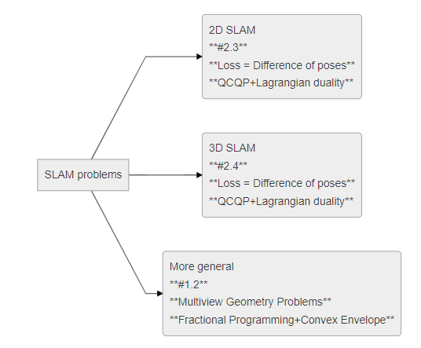
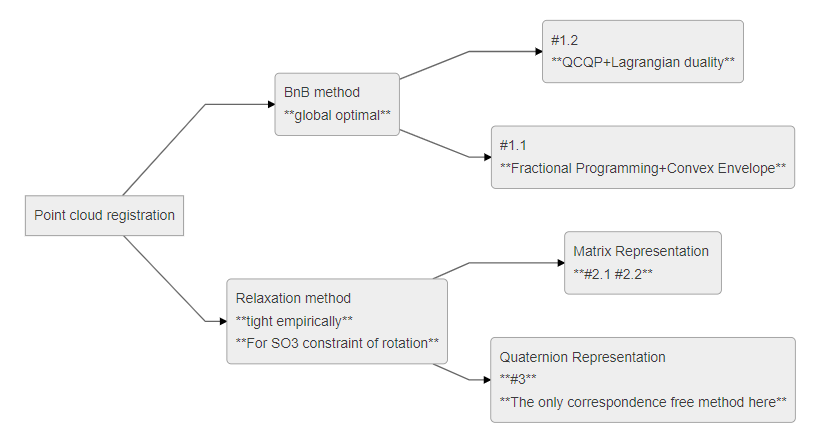
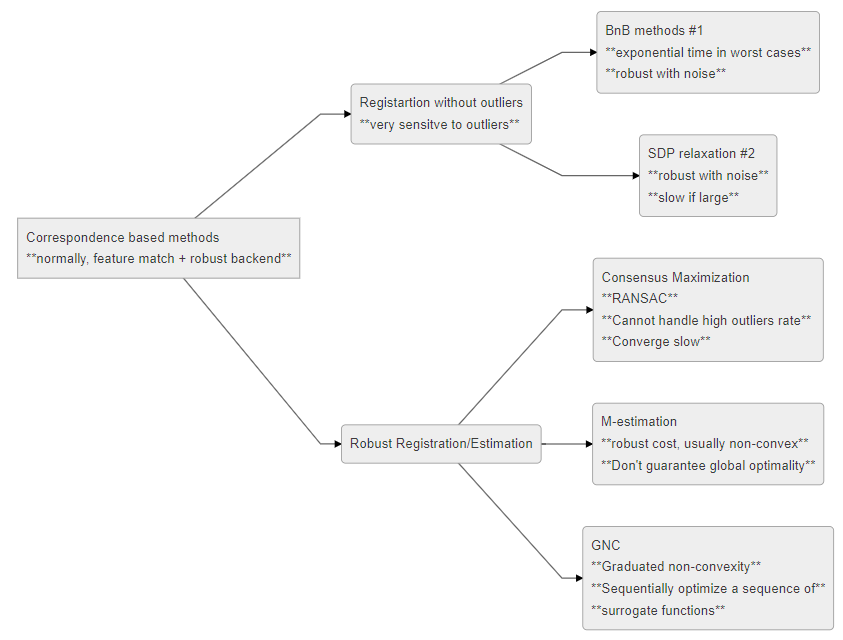
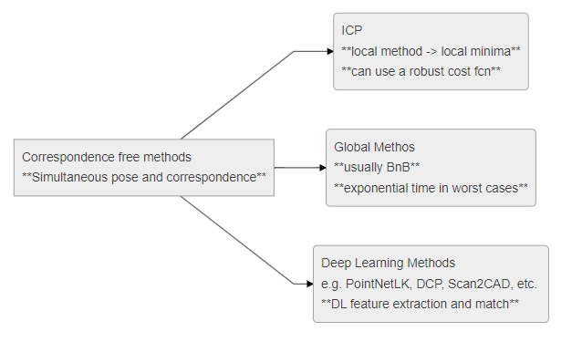

CVX based SLAM related algorithms
==============================

It is a summary of a few point cloud matching algorithms based on convex optimzation theory.

1. Banch and Bound
==========================

1.1 Practical Global Optimization for Multiview Geometry
--------------------------------------------------
`Article <http://www.researchgate.net/profile/Serge_Belongie/publication/225439941_Practical_Global_Optimization_for_Multiview_Geometry/links/0fcfd5086e4e7aa60f000000>`_

This article talks about using Banch and Bound algorithm for three types of Multiview Geometry problems:
* Camera pixels triangualtion
* Camera Resectioning, which is to estimate camera matrix P.
* Projection from :math:`\mathbf{P}^{n}` to :math:`\mathbf{P}^{m}`, which could be homography estimation and use 3d point matches to estiamte relative transformation.

This article uses :

* Fractinal Programming to reform these problems
* Using Convex Envelope of these Fractinal problems as a lower bound for Banch and Bound
* Use three type of nosie models :

**Ordinary Gaussian noise model**

.. math::
  p(x|x') =  \frac{1}{2 \pi \sigma^{2}} \exp( - \frac{ \| x - x' \|^{2}_{2}}{2\sigma^{2}})

**A special case for Laplace nosie**

.. math::
  p(x|x') =  \frac{1}{2 \pi \sigma} \exp( - \frac{ \| x - x' \|_{2}}{\sigma})

**Bivariate Laplace distribution**

.. math::
  p(x|x') =  \frac{1}{4 \sigma} \exp( - \frac{ \| x - x' \|_{1}}{\sigma})

.. image:: https://img-blog.csdnimg.cn/20200608151450625.png?x-oss-process=image/watermark,type_ZmFuZ3poZW5naGVpdGk,shadow_10,text_aHR0cHM6Ly9ibG9nLmNzZG4ubmV0L3dlaXhpbl80NDQ5MjAyNA==,size_16,color_FFFFFF,t_70
    :align: center

* it shows that the tridational method (Bundle Adjustment method) for point cloud match is very senstive to noise, and easily trapped in local minimal. While BNB method find a global optimal is apparent much better.

* And it shows that **L2 Guassian noise model** shows better result for camera resectioning (the least reprojection error). While **L1 Laplacian model** shows better result for ICP type problems.

* And from the Table2, we can see a real **L1 norm** will conerge much faster. (It may be true that the 21 centry is the centry for L1 norm)

1.2 Branch-and-Bound Methods for Euclidean Registration Problems
------------------------------------------

`Article <https://www.researchgate.net/publication/24213723_Branch-and-Bound_Methods_for_Euclidean_Registration_Problems?enrichId=rgreq-9861f218523209ac6405a5bec452f72f-XXX&enrichSource=Y292ZXJQYWdlOzI0MjEzNzIzO0FTOjEwNDUxNzU1OTM5MDIwOUAxNDAxOTMwMzM2MDg0&el=1_x_3&_esc=publicationCoverPdf>`_

This is a article focus on the 3D points registration problems, which needs already matched point pairs.
The lower bounds are obtained by Convex relaxations of :math:`\mathbf{SO}(3)`, which is the rotation part.
It uses quaternion expression of the rotation. And apply a convex envelop over :math:`q_{i}q_{j}`.

* It shows a much better result compared to linear algebra methods (DLT), and have a competable result compared to DLT + bundle adjustment.
* It is much much more stable compared to the other methods.
* While even though they didn't show, I think the comptation time it needs is much more than the other two methods.

2. Lagrangian Duality
================================

2.1 Convex Global 3D Registration with Lagrangian Duality
--------------------------------------------

`Article <https://www.researchgate.net/publication/320964493_Convex_Global_3D_Registration_with_Lagrangian_Duality>`_

This article focus on Lagrangian Duality of ICP problems, and in practice it shows strong duality holds, and it shows a competable result compared with the article of 1.2(Branch-and-Bound Methods for Euclidean Registration Problems).

* It use the matrix representation of rotation.

* It has a very detail summary of the ICP methods (point-to-point, point-to-line, and point-to-plane).

* It reform the problem into **QCQP** (nonconvex quadratically constrained quadratic programs) (much more about QCQP could be found [here](https://web.stanford.edu/class/ee364b/lectures.html) ), so the problem can be reformed into **SDP** (semidefinite program) via Lagrangian Duality (or via SDP relaxation).

I strongly recommond to read its supplemenraty material, it is a very good learning material for QCQP and ICP.

The results are mainly compared with the article of 1.2(Branch-and-Bound Methods for Euclidean Registration Problems).
It shows that strong duality holds in practice (no proof offered), and this method shows a much more short CPU runtime
 (as we don't need to search).

2.2 Solving Quadratically Constrained Geometrical Problems using Lagrangian Duality
----------------------------------------------

`Article <https://www.researchgate.net/publication/224375577_Solving_Quadratically_Constrained_Geometrical_Problems_using_Lagrangian_Duality?enrichId=rgreq-3868994c4fa6a12376deac34988482d0-XXX&enrichSource=Y292ZXJQYWdlOzIyNDM3NTU3NztBUzoxMDE2OTA5OTI3NTg3ODhAMTQwMTI1NjQzMDEzMw%3D%3D&el=1_x_3&_esc=publicationCoverPdf>`_

This content of this article is already contained in the upper article 1.2 and 1.1.

2.3 Duality-based Verification Techniques for 2D SLAM
-------------------------------

`Article <http://www.researchgate.net/publication/282687190_Duality-based_verification_techniques_for_2D_SLAM>`_

It reform the problem into QCQP and use SDP relaxation to find bound. And this article mainly focus on **a evulation of  SLAM result**, using **a lower bound and a upper bound**. Does not offer a BNB (or other) algorithm to be aimed at solving the problem.

* The loss function is difference of poses.

* It use matrix representation of rotation, and use **Chordal distance(element wise squared norm)** as error term.

* Reform the problem  into QCQP and find SDP relaxations.

* Find a lower bound using exact SDP relaxation and a looser bound using a simplfied SDP.

* Find upper bound by projecting the duality result into feaible set.

Better see the next article for more, which a more detailed version of this work.

2.4 Lagrangian Duality in 3D SLAM: Verification Techniques and Optimal Solutions
---------------------------------------------------

`Article <https://www.researchgate.net/publication/308823892_Lagrangian_duality_in_3D_SLAM_Verification_techniques_and_optimal_solutions>`_

Mostly the same as the article before (2.3 Duality-based Verification Techniques for 2D SLAM) except that it in extended to 3D SLAM problems.

The bounds are good, and these two articles are very good material for a application of relaxation of QCQPs.

3. TEASER++
==================================

`Article <https://www.researchgate.net/publication/338762508_TEASER_Fast_and_Certifiable_Point_Cloud_Registration>`_

This is the main subject here. This method is a **outlier robust, correspondence free** 3D point cloud registration algorithm.  It has three main contributions:

* Truncated Least Squares (TLS) loss function (robust to large outliers)

* Graph-theoretic framework to decouple scale, rotation and translation (it includes the etimation of scale)

* A tight (empirically) SDP relaxation of the rotation estimation.

3.1 Related works
--------------------------------

**Correspondence based methods**:

**Correspondence free methods**:

3.2 Pipeline
---------------------

**Objective function**:

.. math::
  \min_{s >0, \mathbf{R} \in SO(3), t \in \mathbb{R}^{3}} \sum_{i = 1}^{N} \min(\frac{1}{\beta^{2}}
  \|b_{i} - s\mathbf{R}a_{i} - t \|^{2}, \bar c ^{2})

**Marginalize translation**

**Marginalize Rotation**

**Overall**:

.. image:: https://img-blog.csdnimg.cn/20200610104622888.png
    :align: center

.. image:: https://img-blog.csdnimg.cn/20200610104642999.png
    :align: center

.. image:: https://img-blog.csdnimg.cn/20200610104708703.png?x-oss-process=image/watermark,type_ZmFuZ3poZW5naGVpdGk,shadow_10,text_aHR0cHM6Ly9ibG9nLmNzZG4ubmV0L3dlaXhpbl80NDQ5MjAyNA==,size_16,color_FFFFFF,t_70
     :align: center

3.3 Adaptive Voting
---------------------

* It is a generalization of Histogram voting algorithms.

* Used to calculate translation and scale part of the problem.

* Explain by focus on the scale part:
