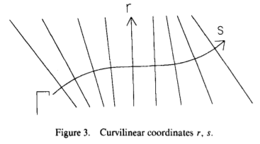
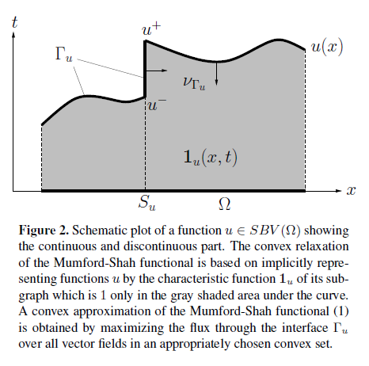

Primal-Dual Mumford-Shah
===========================================

1. Mumford-Shah Functional
---------------------------------------

Firstly, we introduce the **Mumford-Shah Functional** from paper `Optimal approximations by piecewise smooth functions and associated variational problems <https://dash.harvard.edu/bitstream/handle/1/3637121/Mumford_OptimalApproxPiece.pdf?sequence%3D1>`_

We have the g the "image" data, whose domain is in :math:`R\subset \mathbb{R}^{2}`, and f : :math:`\cup R_{i \to \mathbb{R}}` a differentiable smooth function on :math:`\cup R_{i}`

Here we consider to segment the image into :math:`\{ R_{i}\}`, disjoint connected open subsets of R. :math:`\Gamma` will be the
union of the part of the boundary of :math:`R_{i}` inside R, so that :

.. math::
  R = R_{1}\cup R_{2}\cup .. \cup R_{n}\cup \Gamma

And the **Mumford-Shah Function** is defined as a energy function:

.. math::
  E(f, \Gamma) = \mu^{2} \int \int_{R}(f-g)^{2}dxdy + \int \int _{R\setminus \Gamma}\|\triangledown f \|^{2}dxdy + \nu \mid \Gamma\mid

Where we have the first term: to ensure f is close to g. The second term: that f is smooth within the region :math:`R_{i}`.
And the third term , to achieve short boundaries. All the three terms are important, without anyone of them, we will always have a zero optimal trival solution.

1.1 Piecewise constant
~~~~~~~~~~~~~~~~~~~~~~~~~~~~~

The paper discussed several special cases of the functional. Firstly :math:`E_{0}`, which restrict f to be a piecewise constant function.
Alors, the gradient terms of the energy function will be zero. And f(x) in each area will be the mean of g : :math:`mean_{R_{i}}(g)` , we define :

.. math::
  E_{0}(f,\Gamma) = \mu^{-2}E(f,\Gamma) = \sum_{i} \int \int_{R_{i}} (g - mean_{R_{i}}g)^{2}dxdy + \frac{\nu}{\mu}\mid \Gamma \mid

If :math:`\Gamma` fixed , and :math:`\mu\to 0`, f minimize E tends to be a such
piecewise constant . That we have : :math:`E_{0}` **is the natural limit functional of E as** :math:`\mu \to 0`.

In this case, it will be a **The Plateau problem** .

1.2 :math:`E_{\infty}`
~~~~~~~~~~~~~~~~~~~~~~~~~~

The authors also descussed :math:`E_{\infty}` :

.. math::
  \begin{align}
  E_{\infty} &= \int_{\Gamma}[\nu_{\infty} - (\frac{\partial g}{\partial n})^{2}]ds \\
  &= \int_{\Gamma}\rho(dx, dy, x, y) \\
  &= \int_{\Gamma} \frac{\nu_{\infty} (dx^{2}+dy^{2}) - (g_{x}dy + g_{y}dx)^{2} }{\sqrt{dx^{2} + dy^{2}}}
  \end{align}

**Generalized deodesic problem** :

* :math:`E_{\infty}` tends to make length of :math:`\Gamma` as short as possible.
* :math:`E_{\infty}` tends to make g has the largest possible derivative when normal to :math:`\Gamma`.

If we define the solution f to be g when far from the boundaries and take :math:`f_{\infty}` when very close to :math:`\Gamma` :

.. math::
  f_{\infty}(r,s) = g(r,s) + \epsilon sgn(r)\exp(-\mid r\mid / \epsilon)\frac{\partial g}{\partial r}(0,s)

Where :math:`\mu = 1/\epsilon, \ \nu = \epsilon \nu_{infty}`, With this f function, we will have :

.. math::
  E(f_{\infty}, \Gamma) = E(g, \phi) + \epsilon E_{\infty}(\Gamma) + O(\epsilon^{2})

While :math:`\mu \to \infty` we will have :math:`\epsilon \to 0`.
That we have : :math:`E_{\infty}` **is the natural limit functional of E as** :math:`\mu \to \infty`.

2. Convex Relaxation
---------------------------------

This convex relaxation is introduced by `An algorithm for minimizing the mumford-shah functional <https://ieeexplore.ieee.org/document/5459348>`_
Which is also the basic for chapter 3, in this page.

The notaion of Mumford-Shah functional in this article:

.. math::
  E(u) = \lambda \int_{\Omega}(f-u)^{2}dx + \int_{\Omega\setminus S_{u}} \mid\triangledown u\mid^{2}dx + \nu \mathcal{H}^{1}(S_{u})

Where we have f the known observation of the image, :math:`f:\Omega\subset \mathbb{R}^{2} \to \mathbb{R}`, and :math:`u:\Omega\to\mathbb{R}` a piece wise smooth function (our desired solution).

I skip the related works here, as I haven't read them (paper worth reading `An efficient primal-dual hybrid gradient algorithm for total variation image restoration <https://link.springer.com/article/10.1007/s11075-018-0618-8>`_ ).

2.1 Step 1
~~~~~~~~~~~~~~~~~~~~~~~~~~

**Step 1** : this article try to reform the formule of Mumford-Shah functional, by defining :math:`u\in SBV(\Omega)` , the special functions of bounded variation [1]_ .
And define the upper level sets of u by the characteristic function :math:`\mathbf{1}_{u} : \Omega \times \mathbb{R}\to \{0,1\}` of the subgraph of u :

.. math::
  \mathbf{1}_{u}(x,t) = \begin{cases} 1, \quad if \ t < u(x) \\
  0, \quad else \end{cases}

.. [1] i.e. functions u of bounded variation for which the derivative Du is the sum of an absolutely  continuous part :math:`\triangledown u \cdot dx` and a discontinuous singular part :math:`S_{u}`, see Figure 2.

2.2 Step 2
~~~~~~~~~~~~~~~~~~~~~~~~~~

**Step 2 : Theorem 1.** For a function :math:`u\in SBV(\Omega)` the Mumford-Shah functional can be
written as :

.. math::
  E(u) = \sup_{\varphi \in K}\int_{\Omega\times \mathbb{R}}\varphi D\mathbf{1}_{u}

with a convex set :

.. math::
  \begin{align}
  K = & \{  \varphi\in C_{0}(\Omega\times \mathbb{R}; \mathbb{R}^{2}): \\
  & \varphi^{t}(x,t) \ge \frac{\varphi^{x}(x,t)^{2}}{4} - \lambda (t-f(x))^{2}, \\
  &\mid \int_{t_{1}}^{t_{2}} \varphi^{x}(x,s)ds \mid \le \nu ,\\
  &\ x\in \Omega ,\ t, t_{1}, t_{2}\in \mathbb{R} \},
  \end{align}

**Proof Theorem 1.** : First we observe that the right hand part, the intergration, is a integration of changement of the space :math:`\Omega\times \mathbb{R}`,
It is equivalent to the intergraion of the energy flow on the boundary (the normal of the function at boundaries :math:`\nu_{\Gamma_{u}}`):

.. math::
  \int_{\Omega\times \mathbb{R}}\varphi D\mathbf{1}_{u} = \int_{\Gamma_{u}}\varphi\cdot \nu_{\Gamma_{u}}d\mathcal{H}^{2}

.. math::
  \nu_{\Gamma_{u}} = \begin{cases}
  \frac{(\triangledown u, -1)}{\sqrt{\mid\triangledown u \mid^{2} +1}}, \quad if\ u \in \Omega\setminus S_{u} \\
  (\nu_{u},0), \quad \quad if\ u \in S_{u}
  \end{cases}

As in the boundary :math:`\Omega\setminus S_{u}`, we have the gradient w.r.t. t zero, and w.r.t. x :math:`\triangledown u`, followed by a normalization step. And in :math:`S_{u}`, we have
the gradient w.r.t. t zero, and w.r.t. x the unit vector pointing from outside to inside.
Taking this expression into the integration :

.. math::
  \int_{\Gamma_{u}}\varphi\cdot \nu_{\Gamma_{u}}d\mathcal{H}^{2} = \int_{\Omega \setminus S_{u}}\frac{\varphi^{x}\cdot \triangledown u - \varphi^{t}}{\sqrt{\mid\triangledown u \mid^{2} +1}}dx +
  \int_{S_{u}}(\int_{u^{-}}^{u^{+}}\varphi^{x}dt )\nu_{u}d\mathcal{H}^{1}

If we add constraints that :

.. math::
  \frac{\varphi^{x}\cdot \triangledown u - \varphi^{t}}{\sqrt{\mid\triangledown u \mid^{2} +1}} \le \mid\triangledown u\mid^{2} + (f-u)^{2}

.. math::
  \mid \int_{u^{-}}^{u^{+}}\varphi^{x}dt \mid \le \nu

Which is the constraint that :math:`\varphi` lies in the convex set K. And it imples that :

.. math::
  \int_{\Omega\times \mathbb{R}}\varphi D\mathbf{1}_{u} \le E(u)

.. math::
  E(u) \ge \sup_{\varphi \in K}\int_{\Omega\times \mathbb{R}}\varphi D\mathbf{1}_{u}

We could further prove that this difference is rather small, that we could assume it is an equal, with an arbitrarily small error. :math:`\square` .

2.3 Step 3
~~~~~~~~~~~~~~~~~~~~~~~~~~

**Step 3. Relaxation** in the upper reformed Mumford-Shah function, the characteristic function :math:`\mathbf{1}_{u}`  is a non-convex function.
Here we apply a convex relaxation upon this part. Introduce a generic function :math:`v(x,t):\Omega\times\mathbb{R}\to [0,1]` to substitue :math:`\mathbf{1}_{u}` , which satisfies:

.. math::
  \lim_{t\to -\infty}v(x,t)=1, \quad \lim_{t\to +\infty}v(x,t) = 0

Finally, we obtain **the relaxed convex optimization problem** :

.. math::
   \begin{align}
   minimize \quad & \sup_{\varphi\in K}\int_{\Omega\times\mathbb{R}}\varphi Dv \\
   subject\ to \quad & \lim_{t\to -\infty}v(x,t)=1, \quad \lim_{t\to +\infty}v(x,t) = 0
   \end{align}

2.4 Discrete Setting
~~~~~~~~~~~~~~~~~~~~~~~~~

Consider the discrete case. Use a regular :math:`(N\times N)\times M` pixel gird in space :math:`\Omega \times \mathcal{R}` :

.. math::
  G = \{ (i\Delta_{x}, j\Delta_{x}, k\Delta_{t}): i,j = 1,2,...,N, \ k = 1,2,...,M \}

* Authors define the discrete space C for v :

.. math::
  C= \{x\in X\mid x(i,j,k)\in [0,1], x(i,j,1)=1, x(i,j,M)=0 \}

* And develop a discrete version of convex set K.
* The discrete graident operator could be expressed by a matrix A.

Then we have a discrete version of the problem:

.. math::
  \min_{x\in C}\max_{y\in K}<Ax, y>

2.5 Primal-Dual method
~~~~~~~~~~~~~~~~~~~~~~~~~~~~~

Here the authors consider a more general problem:

.. math::
  \min_{x\in C}\max_{y\in K}<Ax,y> + <g,x> -<h,y>

Which is a seddle-point problem, and will be solved by sequential apply Newton's method to the two variables.
The convergence proof could be seen in the paper.

.. math::
  \begin{cases}
  y^{n+1} = \Pi_{K}(y^{n} + \sigma(A\bar{x}^{n}-h)) \\
  x^{n+1} = \Pi_{C}(x^{n} - \tau (A^{*}y^{n+1}+g)) \\
  \bar{x}^{n+1} = 2\cdot x^{n+1} - x^{n}
  \end{cases}

Where :math:`\tau` and :math:`\sigma` are choosen based on :math:`\tau\sigma L^{2}<1` (L : the Lipschitz parameter).
And the projection onto K is calculated using Dykstra's iterative projection algorithm [2]_ (`A method for finding projections onto the intersection of convex sets in Hilbert spaces <https://link.springer.com/chapter/10.1007/978-1-4613-9940-7_3>`_ ).

.. [2] In the next paper, these projections will be generalized to solve using the properties of Moreau's theorem, and the resolvent operator. Or we could intreprete it as `the proximal algorithm <https://cvx-learning.readthedocs.io/en/latest/ProximalAlgorithms/Interpretations.html?highlight=resolvent#resolvent-of-subdifferential-operator>`_ .

3. First-order Primal-Dual
-----------------------------

3.1 Primal-Dual formulation
~~~~~~~~~~~~~~~~~~~

From the paper `A first-order primal-dual algorithm for convex problems with applications to imaging <https://link.springer.com/article/10.1007/s10851-010-0251-1>`_ .
Here a more general saddle-point problem is considered:

.. math::
  \min_{x\in X}\max_{y\in Y}<Kx, y> + G(x) - F^{*}(y)

where :math:`G: X\to [0, +\infty]` and :math:`F^{*} : Y\to [0,+\infty]` are proper, convex, lower-semicontinous (l.s.c) functions. :math:`F^{*}` being
itself the convex conjugate of a convex l.s.c. function F.

.. math::
  F^{*}(y) = \sup_{x}(y^{T}x - F(x))

This saddle-point problem is a primal-dual formulation of the nonlinear primal problem :

.. math::
  \min_{x\in X} F(Kx) + G(x)

or of the corresponding dual problem:

.. math::
  \max_{y\in Y} -(G^{*}(-K^{*}y) + F^{*}(y))

The nonlinear primal problem is equivalent to the problem:

.. math::
  \being{align*}
  &minimize \quad F(y) + G(x) \\
  &subject\ to \quad Kx = y, \ x\in X
  \end{align*}

The lagrangian function is :

.. math::
  \mathcal{L}(x,y, \lambda) = F(y) + G(x) + \lambda^{T}(Kx - y)

We have the dual function :

.. math::
  \begin{align}
  g(\lambda) &= \inf_{x\in X, y}\matcal{L}(x,y,\lambda) \\
  &= \inf_{x\in X,y} -(<\lambda, y> - F(y)) - (<\lambda,Kx> - G(x)) \\
  &= - \sup_{y}(<\lambda ,y> - F(y)) - \sup_{x\in X}(<-K^{*}\lambda,x> - G(x)) \\
  & = -F^{*}(\lambda) - G^{*}(-K^{*}\lambda)
  \end{align}

The beginning of this article shows various of the properties of the resolvent, which has close relation with the `proximal operator <https://cvx-learning.readthedocs.io/en/latest/ProximalAlgorithms/Index.html>`_ .

Especially, that the resolvent operator and the proximal operator are equivalent `interpretation <https://cvx-learning.readthedocs.io/en/latest/ProximalAlgorithms/Interpretations.html#resolvent-of-subdifferential-operator>`_ .

.. math::
  x = (I + \tau \partial F)^{-1}(y) = \mathbf{prox}_{\tau F}(y) = \arg\min_{x}(F(x) + \frac{1}{2\tau}\| x-y\|^{2})

And the `Moreau's decomposition theorem <https://cvx-learning.readthedocs.io/en/latest/ProximalAlgorithms/Properties.html#moreau-decomposition>`_ .

.. math::
  x = \tau \mathbf{prox}_{\tau^{-1}F^{*}}(\tau^{-1}x) + \mathbf{prox}_{\tau F}(x)

.. math::
  x = \tau (I + \tau^{-1}\partial F^{*})^{-1}(\tau^{-1}x) + (I + \tau\partial F )^{-1}(x)

3.2 Algorithm
~~~~~~~~~~~~~~~~

* Initialization : Choose :math:`\tau, \sigma >0, \theta\in [0,1]`, :math:`(x^{0}, y^{0}) \in X\times Y`, and set :math:`\bar{x}^{0} = x^{0}`.
* Iterations : Update :math:`x^{n}, y^{n}, \bar{x}^{n}` as follows:

.. math::
  \begin{cases}
  y^{n+1} = (I +\sigma \partial F^{*})^{-1}(y^{n} + \sigma K \bar{x}^{n}) \\
  x^{n+1} = (I +\tau \partial G)^{-1}(x^{n} - \tau K^{*} y^{n+1}) \\
  \bar{x}^{n+1} = x^{n+1} + \theta (x^{n+1} - x^{n})
  \end{cases}
