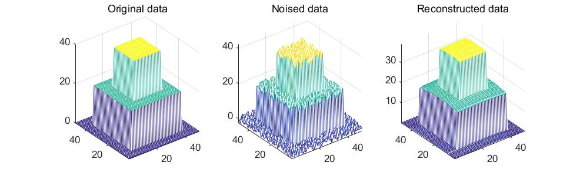

Solving TV via ADMM
=================================

`Solving Constrained Total-variation Image Restoration and Reconstruction Problems via Alternating Direction Methods <http://epubs.siam.org/doi/abs/10.1137/090774823>`_

In brief, using ADMM to solve TV reconstruction problems.

1. Introduction
---------------------------------

We have seen the example which use ADMM to solve one-dimensional total variation problems in the chapter L1-norm of the 'ADMM' documentation.
For 2D cases, the situation is more complicate, as the derivatives have two directions, which makes the problem harder to reformed
into a general ADMM form.
In which case, a circulant matrix is introduced, which can be transformed into diagonal matrix using Discrete Fourier Transformation.

The discrete gradient operator :math:`\partial_{1}` and :math:`\partial_{2}` are linear :math:`\mathcal{R}^{n}\to \mathcal{R}^{n-1}` (e.g. each element is :math:`x_{i+1}-x_{i}`)
For image processing cases, they are discretized in the horizontal and vertical directions respectively.

While in this paper, we introcduce a circular boundary condition to make the gradients :math:`\mathcal{R}^{n}\to \mathcal{R}^{n}`
to make the gradient of each direction a circular boundary conditions:

.. math::
  (\partial_{1}x)(i,j) = \begin{cases} x(i+1,j) - x(i,j) \quad if i \l n_{1} \\
  x(1,j) - x(n_{1},j) \quad i =n_{1} \end{cases}

.. math::
  (\partial_{2}x)(i,j) = \begin{cases} x(i,j+1) - x(i,j) \quad if j \l n_{2} \\
  x(i,1) - x(i,n_{2}) \quad j =n_{2} \end{cases}

* The gradient of x direction could be easily expressed by circular matrix form, while it is harder to process in both directions. (that may be the reason, that some MVS method perfer to apply in to one direction each time)

.. math::
  \partial_{1} = \begin{bmatrix} -1 & 1 & 0 & ... &0& 0\\ 0& -1 & 1& ... &0& 0 \\ ... \\ 1 &0 &0&...&0&-1 \end{bmatrix}

* The counterpart of this formulation is that it can lead to some artifacts on the image borders.
* In this case, the gradient operators are circulant matrix. They could be diagonalized by DFT.

**Diagonalize of Circulant Matrices**:

For the circulant matrix C(w) we have :

.. math::
  C(w) = \begin{bmatrix} w_{1} & w_{2} & w_{3} & ... & w_{n}\\ w_{n}& w_{1} & w_{2}& ... & w_{n-1} \\ ... \\ w_{2} &w_{3} &w_{4}&...&w_{1} \end{bmatrix}

.. math::
  C(w) = \mathbb{F}Diag(\mathbb{F}w)\mathbb{F}^{-1}

.. math::
  C(w) = \mathbb{F}^{-1}Diag(\bar{\mathbb{F}w})\mathbb{F}

Where, :math:`\mathbb{F}\in \mathcal{C}^{n\times k}`:

.. math::
  \mathbb{F} = \begin{bmatrix} 1 & 1 & 1 & ... & 1\\ 1& \omega & \omega^{2}& ... & \omega^{n-1} \\ ... \\ 1 &\omega^{k-1} &\omega^{2(k-1)}&...&\omega^{(n-1)(k-1)} \end{bmatrix}

We can also rescale horizontal or vertical, to make the matrix non-squared. Then, we have :

.. math::
  \partial_{1} = \mathbb{F}^{-1}D_{1}\mathbb{F} \quad and\quad \partial_{2} = \mathbb{F}^{-1}D_{2}\mathbb{F}

2. ADMM
---------------------

see `here <../ADMM/Index.html>`_

3. Application TV-L2
--------------------------

The problem is :

.. math::
  \begin{align*}
  &minimize \quad \| \nabla x\|_{1} + \tau \|Ax- x^{0}\|_{N} \\
  &subject\ to \quad x \in \mathcal{R}^{n}
  \end{align*}

We will solve a similar one :

.. math::
  \begin{align*}
  &minimize \quad \| \nabla x\|_{1} \\
  &subject\ to \quad x \in \mathcal{R}^{n},\ \|Ax- x^{0}\|_{N} \le \alpha
  \end{align*}

Where :math:`\nabla^{T} = [\partial_{1}, \partial_{2}]` .
For N=2,  L2 norm usually corresponding to the restoration of a blurry image with additive Gaussian noise (Gaussian distribution corresponding to L2 norm).
And the take A to be H , a spatially invariant blurry transform. So we have the problem :

.. math::
  \begin{align*}
  &minimize \quad \| \nabla x\|_{1} \\
  &subject\ to \quad x \in \mathcal{R}^{n},\ \|Hx- x^{0}\|_{2} \le \alpha
  \end{align*}

Note the set :

.. math::
  K = \{ x\in \mathcal{R}^{n} \mid \|Hx- x^{0}\|_{2} \le \alpha \}

The problem could be transformed into the consensus form (ADMM form):

.. math::
  \begin{align*}
  &minimize \quad \| \nabla z\|_{1} \\
  &subject\ to \quad x \in K, \ z = \nabla x, \ y\in \mathcal{R}^{n\times n}
  \end{align*}

The ADMM updates are :

.. math::
  \begin{align*}
  & x^{k+1} := \arg\min_{x\in K} (\rho/2)\| \nabla x - z^{k} + u^{k} \|_{2}^{2} \\
  & z^{k+1} := \arg\min_{z}( \mid z\mid + (\rho/2)\| \nabla x^{k+1} - z + u^{k} \|_{2}^{2})\\
  & u^{k+1} := u^{k} + \nabla x^{k+1} - z^{k+1}
  \end{align*}

The upper updates are equvalient to :

.. math::
  \begin{align*}
  & x^{k+1} := \arg\min_{x\in K} (\rho/2)\| \nabla x - z^{k} + u^{k} \|_{2}^{2} \\
  & z^{k+1} := S_{1/\rho}(\nabla x^{k+1}+u^{k}) \\
  & u^{k+1} := u^{k} + \nabla x^{k+1} - z^{k+1}
  \end{align*}

The original paper use the Augmented Lagrangian to derivate the ADMM updates,
while we use the unscaled form of ADMM updates here. They should be equivalent.

**Process in two directions seperatly**:

