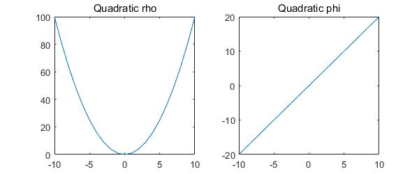
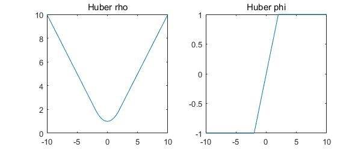
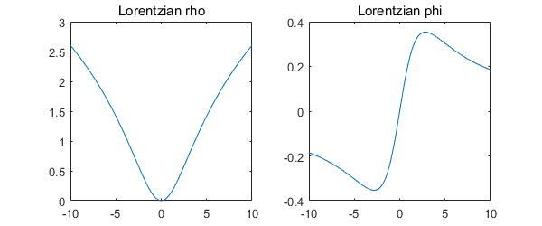
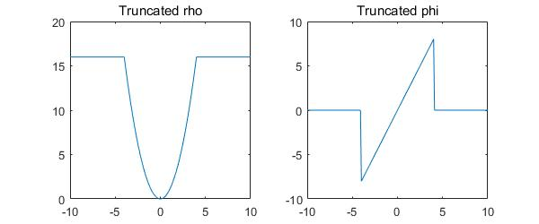
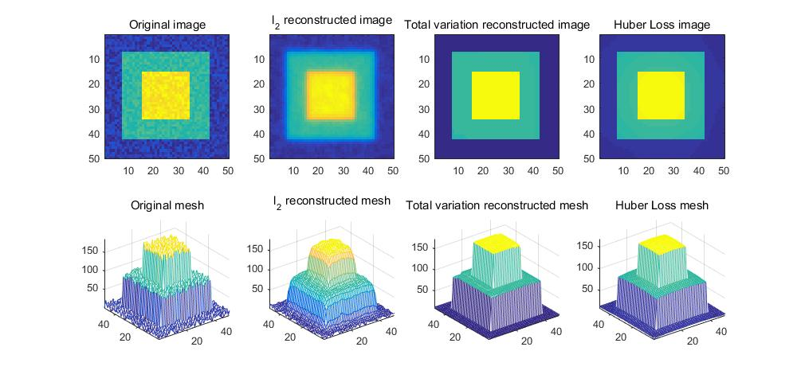

On the Unification of Line Processes, Outlier Rejection, and Robust Statistics
=======================================================

On the Unification of Line Processes, Outlier Rejection, and Robust Statistics with Applications in Early Vision. `paper <https://www.researchgate.net/profile/Anand_Rangarajan/publication/228083825_On_the_unification_of_line_processes_outlier_rejection_and_robuststatistics_with_applications_to_early_vision/links/54ca4af70cf2c70ce521a907.pdf>`_
published 1995.

This paper mainly shows the unification of **line process** (mainly used in Robust Statistics) and **outlier rejection**.

Involving problems:

* Surface Recovery
* Image Segmentation
* Image Reconstruction
* Optical Flow

This paper mainly describes the problem of *recovery of piecewise smooth regions using reguarization*. Explain the Line Process and the
outlier rejection, then shows their connection.

1. L1 Heuristic
------------------------------

The problem can be modeled by the following energy function:

.. math::
  \begin{align*}
  \min_{u} &\ E (u,d)\\
  & = E_{D}(u,d) + E_{S}(u) \\
  & = \sum_{s\in S}[ (u_{s} - d_{s})^{2} + \lambda \sum_{t\in \mathcal{G}_{s}}(u_{s} - u_{t})^{2}   ]
  \end{align*}

Which consists of two terms: measurements (set D), and a smoothness term (set S, function of neighbor points, this term can also be seen as an regularization). All two terms are evulated by L2 norm.
With L2 reguarization term will lead to a *very* smooth result, while we could use L1 norm to perserve sharp edges.

We can realize such reconstruction with Matlab CVX :

**L2 norm**: ::

  cvx_begin
      variable Ul2(m, n);
      Ux = Ul2(2:end,2:end) - Ul2(2:end,1:end-1); % x (horiz) differences
      Uy = Ul2(2:end,2:end) - Ul2(1:end-1,2:end); % y (vert) differences
      minimize(norm([Ux(:); Uy(:)], 2) + gamma_l2*norm(Ul2(Known)-Unoise(Known),2)); % l2 roughness measure
  cvx_end

**L1 norm**: ::

  cvx_begin
      variable Utv(m, n);
      Ux = Utv(2:end,2:end) - Utv(2:end,1:end-1); % x (horiz) differences
      Uy = Utv(2:end,2:end) - Utv(1:end-1,2:end); % y (vert) differences
      minimize(norm([Ux(:); Uy(:)], 1) + gamma_l1*norm(Utv(Known)-Unoise(Known),2)); % tv roughness measure
  cvx_end

2. Line Process
-----------------------

Adding a spatial line process also allows to recover piecewise smooth surface. By defining the following energy function with dual lattice l .

.. math::
  \begin{align*}
  & E (u,d) \\
  & = \sum_{s\in S}( (u_{s} - d_{s})^{2} + \lambda \sum_{t\in \mathcal{G}_{s}}[(u_{s} - u_{t})^{2}l_{s,t}  + \Phi(l_{s,t}) ] )
  \end{align*}

As a result l will be an indicator of inliers, and :math:`\Phi` will be a penalty function:

.. math::
  \begin{align*}
  & l_{s,t} \rightarrow 0, \quad \Phi(l_{s,t}) \rightarrow 1 \ \Rightarrow \ outlier, \ loss = 0\\
  & l_{s,t} \rightarrow 1, \quad \Phi(l_{s,t}) \rightarrow 0 \ \Rightarrow \ inlier, \ loss = r^{2}
  \end{align*}

For an example, we could have :

.. math::
  \Phi(z) = (\sqrt(z)-1)^{2}

3. Robust Statistics
---------------------------
Let's consider the case of model fitting problem. Our objective to minimize a penalty function of the observations and the predictions.

.. math::
  \min_{u} \sum_{s\in S}\rho(d_{s} - u(s;a), \sigma_{s})

* This expression corresponding to M-estimate (Maximum-likelihood estimation)
* The choice of different :math:`\rho` functions results in different robust estimators and the robustness of a particular estimator refers to its insensitivity.

3.1 Robust Estimators
~~~~~~~~~~~~~~~~~~~~~~~~~~~

**Quadratic**:

.. math::
  \rho (x) = x^{2} , \quad \Phi(x) = 2x

The quadratic (least square) approach is notoriously sensitive to outliers, as the error grows greatly as the error increases.

**Huber**:

.. math::
  \phi_{\sigma}(x) = \begin{cases}
  x^{2}/x\sigma + \sigma/2 \quad \mid x\mid \le sigma \\
  \mid x\mid \quad \quad \mid x\mid > \sigma \end{cases}

.. math::
  \Phi_{\sigma}(x) = \begin{cases}
  x/\sigma \quad \mid x\mid \le \sigma \\
  sign(x) \ \mid x \mid > \sigma \end{cases}

**Lorentzian**:

.. math::
  \rho(x, \sigma) = \log(1+\frac{1}{2} (\frac{x}{\sigma})^{2})

.. math::
  \Phi(x, \sigma) = \frac{2x}{2\sigma^{2} +x^{2}}

**Truncated quadratic**:

.. math::
  \rho(x, \beta) = \begin{cases} x^{2} \quad \mid x\mid \le \sqrt{\beta} \\
  \beta \quad otherwise \end{cases}

.. math::
  \Phi(x, \beta) = \begin{cases} 2x \quad \mid x\mid \le \sqrt{\beta} \\
  0 \quad otherwise \end{cases}

3.2 Robust Regularization
~~~~~~~~~~~~~~~~~~~~~~

Apply the robust function to our surface recovery problem:

.. math::
  \begin{align*}
  \min_{u} &\ E (u,d)\\
  & = E_{D}(u,d) + E_{S}(u) \\
  & = \sum_{s\in S}[ \rho_{D}(u_{s} - d_{s}) + \lambda \sum_{t\in \mathcal{G}_{s}} \rho_{S}(u_{s} - u_{t})  ]
  \end{align*}

Huber loss matlab implementation: ::

  cvx_begin quiet
      variable Ulp(m, n);
      Ux = Ulp(2:end,2:end) - Ulp(2:end,1:end-1); % x (horiz) differences
      Uy = Ulp(2:end,2:end) - Ulp(1:end-1,2:end); % y (vert) differences
      minimize(sum(huber([Ux(:); Uy(:)], 0.5)) + gamma*norm(Ulp(Known)-Unoise(Known),2)); % huber roughness measure
  cvx_end

**Result** for example of reconstruction of a noised 'wedding cake' of 50 times 50 pixels:

+--------+--------------+
| method |  cpu time(s) |
+========+==============+
| L2     |  0.28199     |
+--------+--------------+
| L1     |  0.53065     |
+--------+--------------+
| Huber  |   14.93040   |
+--------+--------------+

4. Unifying Robust Estimation and Outlier Processes
-----------------------------------------

* Generalization of the notion of line process.
* Apply to both data and spatial terms.
* Result in robust estimation.

4.1 Outlier Processes
~~~~~~~~~~~~~~~~~~~~~~~

Recall the upper expression, l indicates the outliers, and it is an analog line process. This accounts for violations of the spatial
smoothness term, but does not account for violations of the data term.
So the auther then generalized the notion of a 'line process' to that of an 'outlier process' that can be applied to both data and spatial terms.
To *formulate a process that performs outlier rejection in the same spirit as the robust estimators do*. The surface recovery problem then becomes:

.. math::
  \begin{align*}
  & E (u,d) \\
  & = \sum_{s\in S}( (u_{s} - d_{s})^{2}m_{s} + \Phi_{D}(m_{s}) + \lambda \sum_{t\in \mathcal{G}_{s}}[(u_{s} - u_{t})^{2}l_{s,t}  + \Phi_{S}(l_{s,t}) ] )
  \end{align*}

Where introduce a new indicator for rejecting the measurements. **Notes its similarity to outlier rejection and robust statistics**.

4.2 Outlier Processes to Robust Estimator
~~~~~~~~~~~~~~~~~~~~~~~

The optimization problem then becomes :

.. math::
  \begin{align*}
  \min_{u,m,l}& \sum_{s\in S}[ (u_{s} - d_{s})^{2}m_{s} + \Phi_{D}(m_{s}) ]\\
  &  + \lambda \sum_{s\in S}\sum_{t\in \mathcal{G}_{s}}[(u_{s} - u_{t})^{2}l_{s,t}  + \Phi_{S}(l_{s,t}) ]
  \end{align*}

.. math::
  \begin{align*}
  \min_{u}& \min_{m}[\sum_{s\in S} (u_{s} - d_{s})^{2}m_{s} + \Phi_{D}(m_{s}) ] \\
  &  + \lambda [ \min_{l}\sum_{s\in S}\sum_{t\in \mathcal{G}_{s}}[(u_{s} - u_{t})^{2}l_{s,t}  + \Phi_{S}(l_{s,t}) ] ]
  \end{align*}

The upper expression consists of two parallex minimization process, which are similiar , and can be generalized by the function:

.. math::
  \rho(x) = \inf_{0\le z\le 1}(x^{2}z +\Phi(z))

Finally, we rewrite the problem as :

.. math::
  \min_{u}\sum_{s\in S}\rho_{D}(u_{s}-d_{s}) + \lambda\sum_{s\in S}\sum_{t\in \mathcal{G}_{s}}\rho_{S}(u_{s} - u_{t})

We have exactly the expression of a robust estimation.

**Example** : take :math:`\Phi(z) = (\sqrt(z)-1)^{2}`, where :math:`0\le z \le` :

.. math::
  \begin{align*}
  E(x,z) &= x^{2} + \Phi(z) \\
  &= x^{2} + (\sqrt(z)-1)^{2} \\
  \end{align*}

Minimize with respect to z, we take the first order optimal condition :

.. math::
  \frac{\partial E}{\partial z} (x,z) = x^{2} + \frac{\sqrt{z}-1}{\sqrt{z}} = 0

.. math::
  z = \frac{1}{(x^{2}+1)^{2}}

Then we have :

.. math::
  \rho(x) = \frac{x^{2}}{1+x^{2}}

4.3 From Robust Estimators to Outlier Processes.
