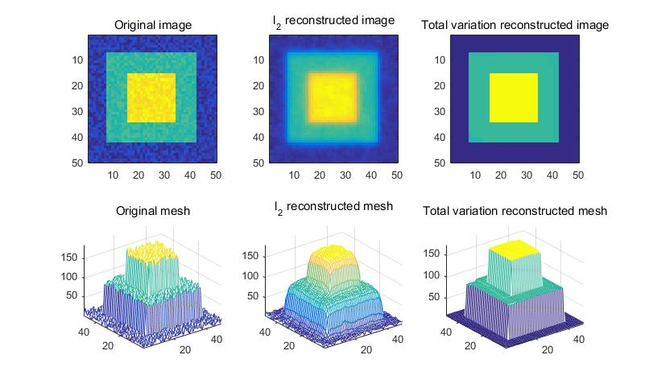

On the Unification of Line Processes, Outlier Rejection, and Robust Statistics
=======================================================

On the Unification of Line Processes, Outlier Rejection, and Robust Statistics with Applications in Early Vision. `paper <https://www.researchgate.net/profile/Anand_Rangarajan/publication/228083825_On_the_unification_of_line_processes_outlier_rejection_and_robuststatistics_with_applications_to_early_vision/links/54ca4af70cf2c70ce521a907.pdf>`_
published 1995.

This paper mainly shows the unification of **line process** (mainly used in Robust Statistics) and **outlier rejection**.

Involving problems:

* Surface Recovery
* Image Segmentation
* Image Reconstruction
* Optical Flow

This paper mainly describes the problem of *recovery of piecewise smooth regions using reguarization*. Explain the Line Process and the
outlier rejection, then shows their connection.

1. L1 Heuristic
------------------------------

The problem can be modeled by the following energy function:

.. math::
  \begin{align*}
  \min_{u} &\ E (u,d)\\
  & = E_{D}(u,d) + E_{S}(u) \\
  & = \sum_{s\in S}[ (u_{s} - d_{s})^{2} + \lambda \sum_{t\in \mathcal{G}_{s}}(u_{s} - u_{t})^{2}   ]
  \end{align*}

Which consists of two terms: measurements (set D), and a smoothness term (set S, function of neighbor points, this term can also be seen as an regularization). All two terms are evulated by L2 norm.
With L2 reguarization term will lead to a *very* smooth result, while we could use L1 norm to perserve sharp edges.

We can realize such reconstruction with Matlab CVX , for example of reconstruction of a noised 'wedding cake':

**L2 norm**: ::

  cvx_begin
      variable Ul2(m, n);
      Ux = Ul2(2:end,2:end) - Ul2(2:end,1:end-1); % x (horiz) differences
      Uy = Ul2(2:end,2:end) - Ul2(1:end-1,2:end); % y (vert) differences
      minimize(norm([Ux(:); Uy(:)], 2) + gamma_l2*norm(Ul2(Known)-Unoise(Known),2)); % l2 roughness measure
  cvx_end

**L1 norm**: ::

  cvx_begin
      variable Utv(m, n);
      Ux = Utv(2:end,2:end) - Utv(2:end,1:end-1); % x (horiz) differences
      Uy = Utv(2:end,2:end) - Utv(1:end-1,2:end); % y (vert) differences
      minimize(norm([Ux(:); Uy(:)], 1) + gamma_l1*norm(Utv(Known)-Unoise(Known),2)); % tv roughness measure
  cvx_end

**Result**:

2. Line Process
-----------------------

Adding a spatial line process also allows to recover piecewise smooth surface. By defining the following energy function with dual lattice l .

.. math::
  \begin{align*}
  & E (u,d) \\
  & = \sum_{s\in S}( (u_{s} - d_{s})^{2} + \lambda \sum_{t\in \mathcal{G}_{s}}[(u_{s} - u_{t})^{2}l_{s,t}  + \Phi(l_{s,t}) ] )
  \end{align*}

The lattice l has the following properties:

.. math::
  \begin{align*}
  & l_{s,t} \rightarrow 0, \quad \Phi(l_{s,t}) \rightarrow 1, \Rightarrow \ outlier, \ loss = 0\\
  & l_{s,t} \rightarrow 1, \quad \Phi(l_{s,t}) \rightarrow 0, \Rightarrow \ inlier, \ loss = r^{2}
  \end{align*}
