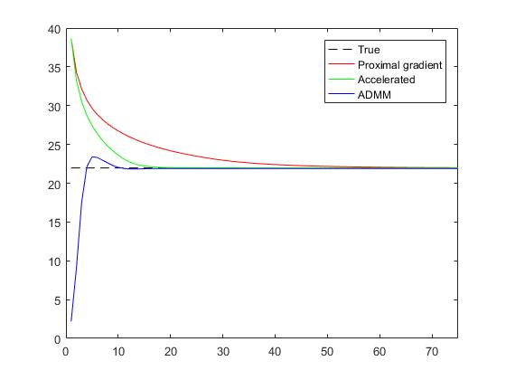

Applications
===========================

Lasso
-------------------

Lasso is short of **Least Absoluate Shrinkage and Selection Operator**. The problem is :

.. math::
  minimize \quad (1/2)\|Ax-b\|^{2}_{2} + \gamma \|x\|_{1}

Proximal gradient method
~~~~~~~~~~~~~~~~~~~~~

It carries out variable selection (by the l1 heuristic), and model fitting (by the least square).
Consider the splitting :

.. math::
  f(x) = (1/2)\|Ax-b\|^{2}_{2} ,\quad g(x) = \gamma \|x\|_{1}

With the gradient and proximal operator:

.. math::
  \Delta f(x) = A^{T}(Ax - b), \quad \mathbf{prox}_{g}(x) = S_{\gamma}(x) = (x - \gamma)_{+} - (-x -\gamma)_{+}

The proximal gradient method will be :

.. math::
  \begin{align*}
  x^{k+1} &:= \mathbf{prox}_{\lambda^{k} g} (x^{k} - \lambda^{k} \Delta f(x^{k})) \\
  & = S_{\lambda^{k}\gamma}(x^{k} - \lambda^{k}A^{T}(Ax - b))
  \end{align*}

The proximal gradient method is also called **ISTA** (iterative shrinkage-thresholding algorithm),
while the accelerated version is known as **FISTA** (fast ISTA), the fast version is basicly adding a momentum.
As the proximal gradient method can be interpreted as seperately optimize f and g.

* We can further accelerate the algorithm by parallex matrix-vector multiplication.
* Or even use the **Gram matrix** as mentioned in Chapter "Evaluating Proximal Operator".
* If we want solution for multiply :math:`\gamma`, we can use the solution of the largest :math:`\gamma` as warm starting.

ADMM
~~~~~~~~~~~~~~~~~~~~~~~~~~

f is quadratic function, we can use the tricks as before:

* Reuse of factorization.
* Warm start with previous gradient, if use an iterative method.
* if n much smaller, we can precompute the Gram matrix.

.. math::
  \begin{align*}
  &x^{k+1} := (A^{T}A + (1/\lambda))^{-1}(A^{T}b + (1/\lambda)(z^{k} - u^{k}) ) \\
  &z^{k+1} := S_{\lambda^{k}\gamma}(x^{k+1} + u^{k})\\
  &u^{k+1} := u^{k} + x^{k+1} - z^{k+1}
  \end{align*}

Test
~~~~~~~~~~~~~~~~~~~~~~~~

Here we should pay attention to the update of x. With :math:`A\in \mathbb{R}^{m \times n}`, if m larger than n,
we should use the expression upper. While in the case when m is smaller than n, we can reform the process
to accelerate:

.. math::
  (A^{T}A + (1/\lambda))x = A^{T}b + (1/\lambda)(z^{k} - u^{k}) \triangleq q

.. math::
  A(A^{T}A + (1/\lambda))x = Aq

.. math::
  (AA^{T}A + A(1/\lambda))x = Aq

.. math::
  (AA^{T} + (1/\lambda))Ax = Aq

.. math::
  A^{T}Ax = A^{T}(AA^{T} + (1/\lambda))^{-1}Aq \triangleq p

Using this in the original equation we have:

.. math::
  (A^{T}A + (1/\lambda))x = q

.. math::
  p + (1/\lambda)x = q

.. math::
  x = \lambda (q - p)

we will have the corresponding code in matlab as ::

   L = chol(speye(m) + lambda*(A*A'), 'lower');
   L = sparse(L); U = sparse(L');
   q = Atb + rho*(z - u);
   x = lambda*(q - lambda*(A'*(U \ ( L \ (A*q) ))));

The original codes could be found `here <http://stanford.edu/~boyd/papers/prox_algs/lasso.html>`_,
The result run times are :

* CVX time elapsed: 25.06 seconds.
* Proximal gradient time elapsed: 0.35 seconds.
* Fast prox gradient time elapsed: 0.17 seconds.
* ADMM time elapsed: 0.04 seconds.

Matrix decomposition
------------------------

The problem is to decompose matrix A into a sum of components :math:`X_{i}`

.. math::
  \begin{align*}
  &minimize \quad \phi_{1}(X_{1}) + \gamma_{2}\phi_{2}(X_{2}) + \cdot\cdot\cdot + \gamma_{N}\phi_{N}(X_{N}) \\
  &subject\quad to\quad X_{1} + X_{2} + \cdot\cdot\cdot + X_{N} = A
  \end{align*}

The function :math:`\phi(X)` can usually be seen as 'penalties', to drive :math:`X_{i}` to have our objective properties.

* **Squared Frobenius norm**: :math:`\phi(X) = \|X\|_{F}^{2} = \sum_{i,j}X_{i,j}^{2}`, to encourage X to be small.
* **Entrywise l1 norm**: :math:`\phi(X) = \|X\|_{1} = \sum_{i,j}\mid X_{i,j}\mid`, to encourage X to be sparse.
* **Sum-column-norm**: :math:`\phi(X) = \sum_{j}\|x_{j}\|_{2}`, to encourage column sparsity. (can be interpreted as group lasso regulization)
* **Elementwise constraints**: :math:`X_{i,j}\in C_{i,j}`, for instant, we want to fixed some entries (fixed sparse pattern).
* **Separable convex function**: :math:`\phi(X) = \sum_{i=1}^{m}\sum_{j=1}^{n}\phi_{i,j}(X_{i,j})`. For instant, constrain the subblock of the matrix.
* **Semidefinite cone constraint**: :math:`X \succeq 0`.
* **Nuclear norm**: :math:`\phi(X) = \|X\|_{*}`, encourage X to be low rank.

For an example, take :math:`\phi_{1}` be the Squred Frobenius norm,:math:`\phi_{2}` be the entrywise l1 norm, :math:`\phi_{3}`
be the Nuclear norm, the problem can be reformed into:

.. math::
  minimize \quad \|A-(X_{2} + X_{3})\|_{F}^{2} + \gamma_{2}\|X_{2}\|_{1} + \gamma_{3}\|X_{3}\|_{*}

So we will decompose A into a sum of a small matrix :math:`X_{1}`, a sparse matrix :math:`X_{2}`, and a low rank matrix :math:`X_{3}`.

ADMM
~~~~~~~~~~~~~~~~~~~~

Consider the splitting:

.. math::
  f(X) = \sum_{i = 1}^{N}\phi_{i}(X_{i}), \quad g(X)= I_{\mathcal{C}}(X)

where :math:`X = (X_{1}, ..., X_{N})`, and :

.. math::
  \mathcal{C} = \left\{ (X_{1},...,X_{N}) \mid \sum_{i=1}^{N}X_{i} = A \right\}

f is to evulate the objective function, and g is to project onto :math:`\mathcal{C}`: the feasible set.
The projection is fairly simple, which is similar to a translation of centroid:

.. math::
  \Pi_{\mathcal{C}}(X) = X - \bar X + (1/N)A

So the final algorithms looks as follows:

.. math::
  \begin{align*}
  &X_{i}^{k+1} := \mathbf{prox}_{\lambda \phi_{i}}(X_{i}^{k} - \bar X^{k} + (1/N)A - U^{k}) \\
  &U^{k+1} := U^{k} + \bar X^{k+1} - (1/N)A
  \end{align*}
