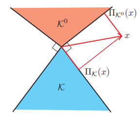

Properties
==============================

Separable sum
--------------------------

If f is seperable across two variables, so :math:`f(x,y) = \phi(x) + \psi(y)`, then:

.. math::
  \mathbf{prox}_{\lambda f}(v, w) = (\mathbf{prox}_{\lambda \phi}(v), \mathbf{prox}_{\lambda \psi}(w))

***Proof:***

.. math::
  \begin{align*}
  \mathbf{prox}_{\lambda f}(v, w) & = \mathop{\arg\min}_{x, y} (f(x, y) + \frac{1}{2 \lambda}\|
  \begin{bmatrix} x \\ y \end{bmatrix} - \begin{bmatrix} v \\ w \end{bmatrix} \|_{2}^{2})   \\
  &= \mathop{\arg\min}_{x, y} (\phi(x) + \psi(y) + \frac{1}{2 \lambda}\| x - v\|_{2}^{2} + \frac{1}{2 \lambda}\| y - w \|_{2}^{2}) \\
  &= (\mathbf{prox}_{\lambda \phi}(v), \mathbf{prox}_{\lambda \psi}(w))
  \end{align*}

Basic operations
------------------------

Post-Composition
~~~~~~~~~~~~~~~~~~~~~~

If :math:`f(x) = \alpha \phi(x) + b`, with :math:`\alpha > 0`, then:

.. math::
    \mathbf{prox}_{\lambda f}(v) = \mathbf{prox}_{\alpha \lambda \phi}(v)

***Proof:***

.. math::
  \begin{align*}
  \mathbf{prox}_{\lambda f}(v) & = \mathop{\arg\min}_{x} (\alpha\phi(x) + b + \frac{1}{2 \lambda}\| x - v\|_{2}^{2})   \\
  &= \mathop{\arg\min}_{x} \alpha(\phi(x) + \frac{1}{2 \lambda \alpha}\| x - v\|_{2}^{2})   \\
  &= \mathbf{prox}_{\alpha \lambda \phi}(v)
  \end{align*}

Pre-Composition
~~~~~~~~~~~~~~~~~~~~~~~~

If :math:`f(x) = \phi(\alpha x + b)`, with :math:`\alpha \ne 0`, then:

.. math::
    \mathbf{prox}_{\lambda f}(v) = \frac{1}{\alpha}(\mathbf{prox}_{\alpha^{2} \lambda \phi}(\alpha v +b) - b)

***Proof:***

.. math::
  \begin{align*}
  \mathbf{prox}_{\lambda f}(v) & = \mathop{\arg\min}_{x} (phi(\alpha x+b) + \frac{1}{2 \lambda}\| x - v\|_{2}^{2})   \\
  &= \mathop{\arg\min}_{x} \alpha(\phi(\alpha x+b) + \frac{1}{2 \lambda \alpha^{2}}\| (\alpha x +b) - (\alpha v +b)\|_{2}^{2})   \\
  &= \frac{1}{\alpha}(\mathbf{prox}_{\alpha^{2} \lambda \phi}(\alpha v +b) - b)
  \end{align*}

If :math:`f(x) = \phi(Q x )`, with Q orthogonal, then:

.. math::
    \mathbf{prox}_{\lambda f}(v) = Q^{T}\mathbf{prox}_{\lambda \phi}(Q v )

Affine addition
~~~~~~~~~~~~~~~~~~~~~~~~~~~~
If :math:`f(x) = \phi(x) + a^{T}x + b`, then :

.. math::
    \mathbf{prox}_{\lambda f}(v) = \mathbf{prox}_{\lambda \phi}(v - \lambda a)

***Proof:***

.. math::
  \begin{align*}
  \mathbf{prox}_{\lambda f}(v) &= \mathop{\arg\min}_{x} (phi(x) + a^{T}x + b + \frac{1}{2 \lambda}\| x - v\|_{2}^{2})   \\
  &= \mathop{\arg\min}_{x} (phi(x) + \frac{1}{2 \lambda}(x^{T}x + v^{T}v - 2v^{T}x + 2 \lambda a^{T}x) )   \\
  &= \mathop{\arg\min}_{x} (phi(x) + \frac{1}{2 \lambda}(x^{T}x + v^{T}v - 2(v^{T} - \lambda a^{T})x)) )   \\
  &= \mathbf{prox}_{\lambda \phi}(v - \lambda a)
  \end{align*}

In the last few equations, notices that we can add term of a and v.

Regularization
~~~~~~~~~~~~~~~~~~~~~~

If :math:`f(x)=\phi(x) + (\frac{\rho}{2} \| x- a\|^{2}_{2})`, then:

.. math::
    \mathbf{prox}_{\lambda f}(v) = \mathbf{prox}_{\bar{\lambda} \phi}(\frac{\bar{\lambda}}{\lambda}v - (\rho \bar{\lambda})a)

where :math:`\bar{\lambda} = \lambda /(1+\lambda \rho)`

Fixed Points
-----------------------------

The point :math:`x^{*}` minimizes f if and only if:

.. math::
  x^{*} = \mathbf{prox}_{\lambda f}(x^{*})

***Proof:*** Can be found in the paper chapter 2.

Lipschitz continuous
~~~~~~~~~~~~~~~~~~~~~

(Mostly from Wikipedia) Given two metric space :math:`(X, d_{X})` and :math:`(Y, d_{Y})`, where :math:`d_{X}`
denotes the metric on the set X and :math:`d_{Y}` is the metric on the set Y, a function :math:`f : X \to Y` is called
Lipschitz continuous, if exist a constant :math:`K \in \mathbf{R}; K > 0`, such that for any :math:`x_{1}, x_{2} \in X` :

.. math::
  d_{Y}(f(x_{1}), f(x_{2})) \le K d_{X}(x_{1}, x_{2})

For an example, if we have :math:`f : \mathbf{R} \to \mathbf{R}`, and in a l2 space then :

.. math::
  \| f(x_{1}), f(x_{2}) \|_{2} \le K \| x_{1}, x_{2} \|_{2}

We can easily see that, if :math:`K \le 1`, then the distance of function value space be smaller than then the distance in original space.

Fixed point algorithms
~~~~~~~~~~~~~~~~~~~~~~~~~

We can use the properties above to find a converging sequence to get closer to the optimal position, which is the fixed point.
We have, if the Lipschitz continuous with constant K less than 1 (non-expansiveness), then we can repeatedly applying :math:`\mathbf{prox}_{f}`
to converge to the fixed point. As we have :

.. math::
  \| \mathbf{prox}_{f}(x) - \mathbf{prox}_{f}(y) \|_{2}^{2} \le (x-y)^{T}(\mathbf{prox}_{f}(x) - \mathbf{prox}_{f}(y))

The simplest proximal method should be :

.. math::
  x^{k+1} = \mathbf{prox}_{\lambda f}(x^{k})

Proximal average
--------------------------------------

Let :math:`f_{1}, ..., f_{m}` be closed proper convex functions, Then we have that :

.. math::
  \frac{1}{m} \sum_{i=1}^{m} \mathbf{prox}_{f_{i}} = \mathbf{prox}_{g}

Where g could be called the ***proximal average*** of  :math:`f_{1}, ..., f_{m}`.

Moreau decomposition
-----------------------------------

This is an important property. It is closly connected to the duality, and the Moreau envelope.
The main materials for this part from the paper, `Wiki for cvx <https://www.convexoptimization.com/wikimization/index.php/Moreau%27s_decomposition_theorem>`_
and `Math 301 <https://statweb.stanford.edu/~candes/teaching/math301/Lectures/Moreau-Yosida.pdf>`_.

Projection mapping
~~~~~~~~~~~~~~~~~~~~~~~~~

This part from `Wiki for cvx <https://www.convexoptimization.com/wikimization/index.php/Moreau%27s_decomposition_theorem>`_.
Define the projection mapping of a hilbert space.

Let :math:`\mathbb{H},\langle\cdot,\cdot\rangle` be a Hilbert space and :math:`\mathbf{C}` a closed convex set in :math:`\mathbb{H}`,
tge projection mapping :math:`P_{\mathbb{C}}` onto :math:`\mathbb{C}` is the mapping :math:`P_{\mathbb{C}} : \mathbb{H} \to \mathbb{H}`,
defined by  :math:`P_{\mathbb{C}} \in \mathbf{C}` and :

.. math::
  \| x - P_{\mathbf{c}}(x) \| = \min (\| x - y \|; y \in \mathbf{C})

Characterization
~~~~~~~~~~~~~~~~~~~~~~~~
Let :math:`\mathbb{H},\langle\cdot,\cdot\rangle` be a Hilbert space, :math:`\mathcal{C}` a closed convex set in :math:'\mathbb{H},\,u\in\mathbb{H}`
 and :math:`v\in\mathcal{C}`. Then :math:`v=P_{\mathcal{C}}(u)` if and only if :math:`\langle u-v,w-v\rangle\leq0` for all :math:`w\in\mathcal{C}`.

 Proof
 Suppose that LaTeX: v=P_{\mathcal{C}}u. Let LaTeX: w\in\mathcal{C} and LaTeX: t\in (0,1) be arbitrary. By using the convexity of LaTeX: \mathcal{C}, it follows that LaTeX: (1-t)v+tw\in\mathcal{C}. Then, by using the definition of the projection, we have

 LaTeX:
 \parallel u-v\parallel^2\leq\parallel u-((1-t)v+tw)\parallel^2=\parallel u-v-t(w-v)\parallel^2=\parallel u-v\parallel^2-2t\langle u-v,w-v\rangle+t^2\parallel w-v\parallel^2,

 Hence,

 LaTeX: \langle u-v,w-v\rangle\leq\frac t2\parallel w-v\parallel^2.

 By tending with LaTeX: t\, to LaTeX: 0,\, we get LaTeX: \langle u-v,w-v\rangle\leq0.

 Conversely, suppose that LaTeX: \langle u-v,w-v\rangle\leq0, for all LaTeX: w\in\mathcal C. Then

 LaTeX: \parallel u-w\parallel^2=\parallel u-v-(w-v)\parallel^2=\parallel u-v\parallel^2-2\langle u-v,w-v\rangle+\parallel w-v\parallel^2\geq \parallel u-v\parallel^2,

 for all LaTeX: w\in\mathcal C. Hence, by using the definition of the projection, we get LaTeX: v=P_{\mathcal C}u.

